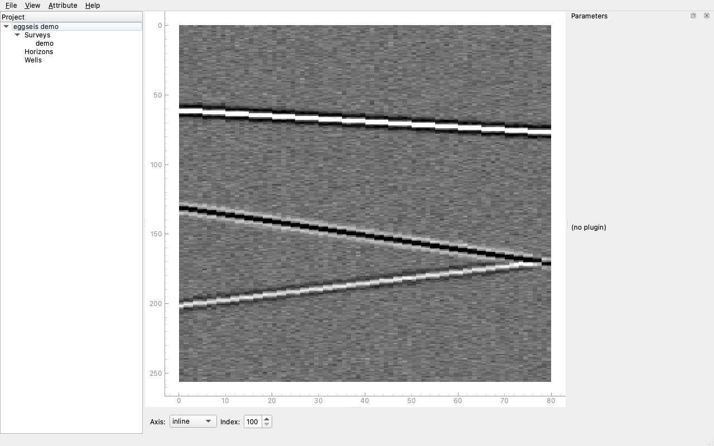

# eggseis

**An open-source desktop application for viewing and analyzing seismic data, with a Python plugin system simple enough that "write a new attribute" is a ten-line script.**

[](https://www.apache.org/licenses/LICENSE-2.0)
[](#status)
[](#installation)

---

eggseis opens 3D seismic volumes, horizons, and wells and lets you interpret them through three linked viewers — a section viewer, a volume viewer, and a crossplot. It reads large surveys without loading them into memory, thanks to [MDIO](https://mdio.dev)'s chunked cloud-native storage underneath. And every built-in attribute is a Python file you can read, copy, and modify.

The goal: **a modern, free, local-first alternative to the commercial seismic interpretation platforms, with a plugin story that actually welcomes new contributors.**

## Your first plugin, in full

This is the complete source of a working bandpass filter plugin. Drop this file in `~/.eggseis/plugins/` and it appears as a selectable attribute in the section viewer on the next launch.

```python
from eggseis.plugin import trace_attribute, Param
from scipy.signal import butter, sosfiltfilt
import numpy as np

@trace_attribute(
    name="my_bandpass",
    display_name="My Bandpass",
    params=[
        Param("low_hz",  float, default=8.0,  range=(0, 125), label="Low cut (Hz)"),
        Param("high_hz", float, default=60.0, range=(0, 125), label="High cut (Hz)"),
        Param("order",   int,   default=4,    range=(1, 10),  label="Order"),
    ],
)
def my_bandpass(trace: np.ndarray, dt: float, *, low_hz, high_hz, order) -> np.ndarray:
    """Zero-phase Butterworth bandpass."""
    fs = 1.0 / dt
    sos = butter(order, [low_hz, high_hz], btype="band", fs=fs, output="sos")
    return sosfiltfilt(sos, trace)
```

The decorator is the registration. The parameters auto-generate the UI. Slider changes update the section viewer live. There is no manifest file, no build step, no compiled artifact, no SDK to learn.

All of eggseis's built-in attributes — envelope, instantaneous phase, AGC, RMS amplitude, reflection strength — are written exactly this way, in public files in the `eggseis/plugins/builtin/` directory. The built-ins are written the same way yours will be.

## Why another seismic tool?

If you've used Petrel, DecisionSpace, Paradigm, or OpendTect, you know each has real strengths — and real gaps.

The commercial platforms are capable but closed and expensive. Their plugin SDKs (Ocean, for example) require corporate developer agreements and .NET expertise. A graduate student with a clever attribute idea can't ship it to the world through Ocean.

[OpendTect](https://dgbes.com/software/opendtect) is the serious open-source contender, and eggseis owes it a real intellectual debt. But its plugin SDK is C++-heavy with a steep ramp, its Python integration is bolted on rather than first-class, and its internal data format predates the modern cloud-native seismic era.

Meanwhile, the Python scientific stack — [segyio](https://github.com/equinor/segyio), [MDIO](https://mdio.dev), [Zarr](https://zarr.dev), [PyVista](https://pyvista.org), [xarray](https://xarray.dev), [PyLops](https://pylops.readthedocs.io) — has matured into something remarkable. But there's no unified application that ties it together. Geoscientists stitch it together in Jupyter, which is powerful but not what you want for daily interpretation work.

eggseis is an attempt to close that gap: a real desktop application built on the modern Python geoscience stack, with a plugin API designed so that **writing a new attribute feels like writing a NumPy function** — because, fundamentally, it is one.

## What eggseis does (v1.0 scope)

**Data** — Import SEG-Y 3D to MDIO via a guided header-mapping wizard. Open and browse MDIO surveys directly. Import horizons (OpendTect ASCII, IHS grid, XYZ CSV) and wells (LAS 2.0/3.0, XYZ deviation).

**Section viewer** — Inline, crossline, and timeslice navigation. Multiple attribute layers with blend modes. Horizon overlays, well overlays with log curves. Crosshair readout, colormap editor, saveable views.

**Volume viewer** — Three draggable orthogonal slicing planes with bounding box (full volume rendering is opt-in). Horizon surfaces and well paths overlaid in 3D. Linked with the section viewer — hover in one, see the cursor move in the other.

**Crossplot** — X/Y/color header selection. Lasso and rectangle selection. Linked selection with the section and volume viewers: highlight a cluster in the crossplot and see exactly where those samples live in the survey. Scales to tens of millions of points via automatic datashader aggregation.

**Plugin system** — Trace-local attributes via a one-line decorator. Auto-generated parameter UI and CLI. Hot-reload from plugin directories. In-memory caching so slider tweaks feel instant. Plugins ship as regular Python packages, discoverable via standard entry points, so `pip install eggseis-my-attributes` just works.

**Project format** — A plain directory on disk. Human-readable YAML manifest. MDIO surveys, HDF5 wells, Zarr horizons. You can zip it, email it, put it in git. No opaque database.

## What eggseis does not do (yet)

Honest scope. These are explicitly **not** in v1.0 and live on the roadmap for v1.1 or later:

- Volume-to-volume transforms (streaming chunk processing)
- Window-based attributes (semblance, dip, curvature)
- Horizon auto-tracking and fault extraction
- Prestack / gathers, 4D surveys
- SEG-Y export and MDIO cloud-storage UI
- Geomodeling, reservoir simulation, inversion
- Petrel or OpenWorks data exchange
- Horizon picking, fault picking, manual interpretation tools
- Web or mobile deployments

If any of those matter to you today, eggseis v1.0 isn't your tool yet. If you're willing to wait, or to help build them, [the roadmap is public](ROADMAP.md) and [contributions are welcome](CONTRIBUTING.md).

## Who it's for

eggseis is built primarily for **industry geoscientists who script a little Python** — people who open SEG-Y files, interpret horizons, and occasionally want to try an attribute idea without writing a research paper about it first.

If you're comfortable with NumPy and SciPy, you can write a plugin for eggseis in an afternoon. If you're comfortable only with off-the-shelf interpretation tools, you can use eggseis as a desktop app without writing any code at all.

It's also useful for academic researchers, consultants, and independent geophysicists who need a capable viewer that isn't tied to a corporate license server.

## Installation

*(Installation instructions will appear here once v0.1 ships. Planned:)*

**Windows / macOS / Linux desktop app** — signed installers from the [releases page](https://github.com/eggseis/eggseis/releases). A Python interpreter and the full scientific stack are bundled — no setup required.

**Python library** — `pip install eggseis` for notebook users.

## Status

eggseis is in **pre-alpha** development. The design is settled; the code is being written.



The roadmap is:

- **M1** — Data layer + CLI *(complete, [v0.1.0a1](CHANGELOG.md))*
- **M2** — Section viewer *(complete, [v0.1.0a2](CHANGELOG.md))*
- **M3** — Plugin API *(in progress; see [`docs/plugin-authoring.md`](docs/plugin-authoring.md))*
- **M4** — Compute engine (threading, debounce, cache)
- **M5** — Plugin pipelines (linear chain + tap-anywhere)
- **M6** — Plugin graphs (DAG + visual node canvas)
- **M7** — Horizons and wells
- **M8** — Volume viewer
- **M9** — Crossplot
- **M10** — Private alpha with early users
- **M11** — v1.0 public release

A running build-in-public log lives at *(TBD)*. Follow along if that's interesting — there will be many bugs and many decisions still being made.

## Architecture at a glance

```
┌──────────────────────────────────────────────────────────┐
│  Viewers: pyqtgraph section, PyVista volume, crossplot   │
│           — coordinated by a shared ViewerSession        │
├──────────────────────────────────────────────────────────┤
│  Compute engine                                          │
│  — job orchestrator, in-memory cache, worker pool        │
│  — progressive tile delivery, debounce, cancellation     │
├──────────────────────────────────────────────────────────┤
│  Plugin API                                              │
│  — @trace_attribute decorator, Pydantic-based params     │
│  — magicgui for auto-generated UI widgets                │
├──────────────────────────────────────────────────────────┤
│  Domain model: SeismicVolume, Horizon, Well              │
│  — stable public API, backend-agnostic                   │
├──────────────────────────────────────────────────────────┤
│  Storage backends                                        │
│  — MDIO (primary), direct SEG-Y read, others future      │
├──────────────────────────────────────────────────────────┤
│  Zarr, segyio, TensorStore                               │
└──────────────────────────────────────────────────────────┘
```

The stack is deliberately boring in a good way: every library above is actively maintained, cross-platform, and permissively licensed. Nothing surprises you on Windows, macOS, or Linux.

Full design docs live in [`docs/design/`](docs/design/).

## Contributing

The single most valuable contribution at this stage is **trying eggseis on your own data and telling us what breaks.**

Beyond that:

- **Write a plugin** — even a simple one. The goal is to make this a 30-minute activity, and we need real plugin authors to tell us where the friction is.
- **Report bugs** with reproducible examples and, if possible, a small dataset.
- **File feature requests** — but understand that many will be answered with "on the roadmap for v2," and that's a feature, not a bug.
- **Improve the docs** — the tutorial, the plugin author guide, the API reference. These are the first impression for everyone after you.
- **Ship a plugin package to PyPI** and we'll link to it from the plugin registry.

See [CONTRIBUTING.md](CONTRIBUTING.md) for the details. Code is contributed under Apache 2.0; we use a lightweight Contributor License Agreement that preserves the project's ability to evolve over time. For local dev setup, the test runner, and the headless GUI workflow, see [docs/development.md](docs/development.md).

## Community

- **Issues & discussions** — [GitHub](https://github.com/eggseis/eggseis)
- **Chat** — the `#eggseis` channel on the [Software Underground Slack](https://softwareunderground.org/)
- **Updates** — build-in-public log at *(TBD)*

We follow the [Software Underground Code of Conduct](https://softwareunderground.org/code-of-conduct).

## License

eggseis is licensed under the [Apache License 2.0](LICENSE).

Apache 2.0 was chosen deliberately:

- You can use eggseis in commercial products, including closed-source ones.
- You can write closed-source plugins.
- You get explicit patent protection.
- Contributions back to the project are welcome but not required.

The goal is to grow a large commons. Closed-source extensions are fine; we just want the core to remain open and healthy.

The *name* "eggseis" and the project logo are not covered by the license; please don't confuse users by forking under the same name.

## Acknowledgements

eggseis stands on the shoulders of a lot of excellent open-source work. Particular thanks to the teams behind:

- **[MDIO](https://mdio.dev)** (TGS) — the cloud-native seismic format that makes eggseis's storage layer possible.
- **[segyio](https://github.com/equinor/segyio)** (Equinor) — the SEG-Y reader that everything downstream relies on.
- **[Zarr](https://zarr.dev)**, **[xarray](https://xarray.dev)**, **[Dask](https://dask.org)** — the chunked-array ecosystem that made this design tractable.
- **[PyVista](https://pyvista.org)** and **[VTK](https://vtk.org)** — 3D rendering that would have taken us a decade to build ourselves.
- **[pyqtgraph](https://pyqtgraph.readthedocs.io)** — fast, clean, NumPy-first 2D plotting.
- **[magicgui](https://pyapp-kit.github.io/magicgui/)** (napari team) — the bridge from type hints to Qt widgets.
- **[OpendTect](https://dgbes.com/software/opendtect)** — twenty years of proving that open-source seismic interpretation is possible. eggseis is, in many ways, a rethink of what that project pioneered.

And to the [Software Underground](https://softwareunderground.org/) community — the reason open-source geoscience has the energy it does today.

---

*eggseis is a personal project. It is not affiliated with or endorsed by any of the companies or projects named above.*
