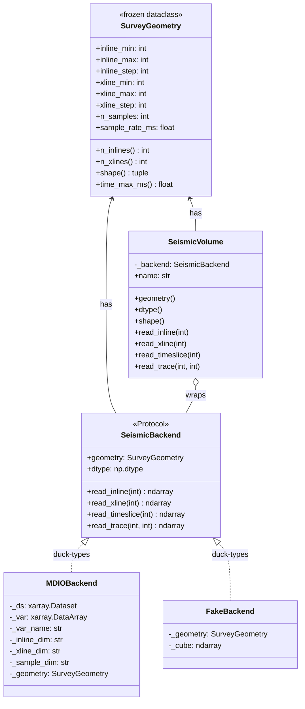

# M1 Architecture — Data Layer

This document captures the class structure and runtime call paths of the M1 data layer. It complements [`M1-PLAN.md`](../../M1-PLAN.md), which describes the milestone scope.

## Class diagram



## Class structure (ASCII)

```
                              ┌─────────────────────────────────┐
                              │  SurveyGeometry  (frozen dataclass)
                              │  ─────────────────────────────────
                              │  inline_min/max/step : int
                              │  xline_min/max/step  : int
                              │  n_samples           : int
                              │  sample_rate_ms      : float
                              │  + n_inlines  (prop)
                              │  + n_xlines   (prop)
                              │  + shape      (prop)
                              │  + time_max_ms (prop)
                              └─────────────────────────────────┘
                                  ▲                       ▲
                                  │ has-a                 │ has-a
                                  │                       │
                ┌─────────────────┴───┐     ┌─────────────┴─────────────┐
                │  SeismicBackend     │     │  SeismicVolume            │
                │  «Protocol»         │◀────┤  ─────────────────────────│
                │  ─────────────────  │ has │  - _backend : SeismicBackend
                │  + geometry: SG     │     │  + name     : str          │
                │  + dtype:    dtype  │     │  + geometry : SG (delegated)
                │  + read_inline()    │     │  + dtype    : dtype  (del.) │
                │  + read_xline()     │     │  + shape    : tuple  (del.) │
                │  + read_timeslice() │     │  + read_inline()    (del.) │
                │  + read_trace()     │     │  + read_xline()     (del.) │
                └─────────────────────┘     │  + read_timeslice() (del.) │
                  ▲ structurally satisfies  │  + read_trace()     (del.) │
                  │ (duck typing)           └────────────────────────────┘
        ┌─────────┴─────────┐
        │                   │
┌───────┴────────┐   ┌──────┴──────────┐
│  MDIOBackend   │   │  FakeBackend    │  (tests/conftest.py)
│  ────────────  │   │  ─────────────  │
│  - _ds         │   │  - _geometry    │
│  - _var        │   │  - _cube (numpy)│
│  - _var_name   │   │   in-memory     │
│  - _inline_dim │   │   deterministic │
│  - _xline_dim  │   │   (seed=42)     │
│  - _sample_dim │   └─────────────────┘
│  - _geometry   │
└────────┬───────┘
         │ uses (lazy)
         ▼
   xarray.Dataset
   (mdio.open_mdio)
         │ chunks fetched on .values
         ▼
   Zarr store on disk
```

## Runtime flow — `eggseis info <survey>`

```
┌─────────────────────────────┐
│ Shell: eggseis info demo... │
└──────────────┬──────────────┘
               │ entry_point script (.venv/bin/eggseis)
               ▼
┌─────────────────────────────┐      pyproject.toml:
│ eggseis.cli:app             │      [project.scripts]
│ (typer.Typer)               │        eggseis = "eggseis.cli:app"
└──────────────┬──────────────┘
               │ dispatch by command name
               ▼
┌─────────────────────────────┐
│ cli.info(survey)            │  src/eggseis/cli.py
└──────────────┬──────────────┘
               │ calls
               ▼
┌─────────────────────────────┐
│ cli._open(survey)           │
│   ↓                         │
│ MDIOBackend(path)           │── ctor opens lazy Dataset
│   ↓                         │   resolves dims + var name
│ SeismicVolume(backend, ...) │── thin wrapper
└──────────────┬──────────────┘
               │ returns SeismicVolume
               ▼
┌─────────────────────────────┐
│ volume.geometry             │── delegates to backend._geometry
└──────────────┬──────────────┘
               │ returns SurveyGeometry
               ▼
┌─────────────────────────────┐
│ rich.Table.add_row(...)     │
│ rich.Console.print(table)   │
└──────────────┬──────────────┘
               ▼
        terminal output
```

## Runtime flow — `eggseis dump-inline <survey> <N>`

```
cli.dump_inline(survey, inline=130)
  │
  ├─► _open(survey) ──► MDIOBackend ──► open_mdio() lazy Dataset
  │                                            │
  ├─► volume.read_inline(130) ─────────────────┤
  │                                            │
  │     SeismicVolume.read_inline ────────────►│
  │       │                                    │
  │       └──► self._backend.read_inline(130) ─┤
  │              │                             │
  │              └──► self._var                │
  │                    .sel({inline_dim:130})  │  ← lazy filter
  │                    .transpose(xl, sample)  │  ← lazy reorder
  │                    .values  ───────────────► fetches Zarr chunks
  │                                                returns numpy ndarray
  │                                                shape (n_xline, n_sample)
  │  ◄──────────────────────────────────────────  
  │
  ├─► np.percentile + clip + scale  (numpy ops)
  │
  ├─► PIL.Image.fromarray(uint8)
  │   .save("inline.png")
  │
  └─► rich.Console.print("Wrote ...")
```

## Test wiring

```
   pytest fixtures (tests/conftest.py)
   ─────────────────────────────────
   fake_backend  ──► FakeBackend()  ──┐
                                      │ injected into
                                      ▼
                              test_volume_*
                              (tests/test_data.py)
                              passes Volume tests w/o I/O


   sample_mdio_path (session) ──► _build_synthetic_mdio()
        │                              │
        │                              ├─► xarray.Dataset (in-memory)
        │                              └─► mdio.to_mdio() ──► Zarr on disk
        ▼
   tests/test_mdio_backend.py
        │
        └─► MDIOBackend(sample_mdio_path)
              │
              └─► open_mdio() reads back
              └─► assertions on geometry + slice shapes
```

## Key relationships

1. **`SeismicVolume` wraps a `SeismicBackend`** — composition, not inheritance. The volume is a thin façade; all reads delegate to the backend. This is the seam where future viewers (section, volume, crossplot per ROADMAP M2/M6/M7) attach.

2. **`SeismicBackend` is a `Protocol`** — Python's structural typing equivalent of an interface. `MDIOBackend` and `FakeBackend` don't declare implementation; they simply expose the right shape. `isinstance(b, SeismicBackend)` returns `True` at runtime via `@runtime_checkable`. New backends (OpenVDS, TileDB — see [ROADMAP.md](../../ROADMAP.md)) implement the same Protocol.

3. **`SurveyGeometry` is the single source of geometry truth.** Owned by the backend, surfaced read-only by the volume. Frozen dataclass → hashable, immutable, future-friendly as a cache key when the M4 compute engine lands.

4. **`MDIOBackend` owns all xarray internals.** `_ds`, `_var`, dim-name caches never leak out. Volume and CLI never touch xarray. Swapping the backend leaves the upstream code untouched — exactly what ROADMAP's "abstraction layer" decision was meant to deliver.

5. **`FakeBackend` is the test seam.** Same structural shape, in-memory, deterministic (`seed=42`). Lets us test `SeismicVolume` without disk I/O. Why Protocol-not-inheritance pays off: zero ceremony to add this.

## Where new code lands in this graph

| Future feature | Goes here |
|---|---|
| New storage backend (OpenVDS, TileDB) | New class implementing `SeismicBackend` |
| New attribute/plugin (M3) | Operates on `SeismicVolume.read_inline` etc. |
| Section viewer (M2) | Consumer of `SeismicVolume` |
| Volume / crossplot viewers (M6/M7) | Same — all hang off `SeismicVolume` |
| Compute engine cache (M4) | Wraps the volume; key = `(plugin_id, params, slice_kind, idx, survey_version)` |

The graph stays small for M1. The shape was chosen so each later milestone slots in without breaking the data layer.
